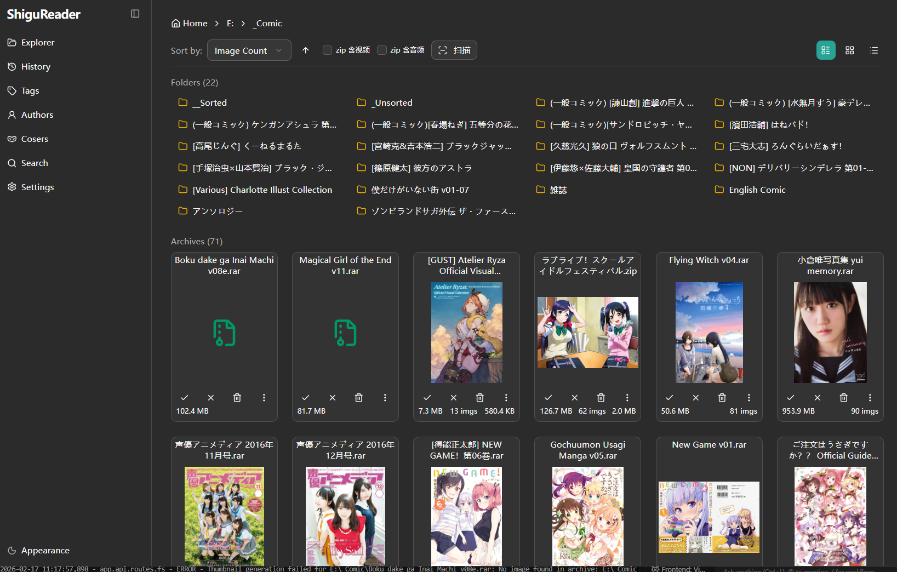
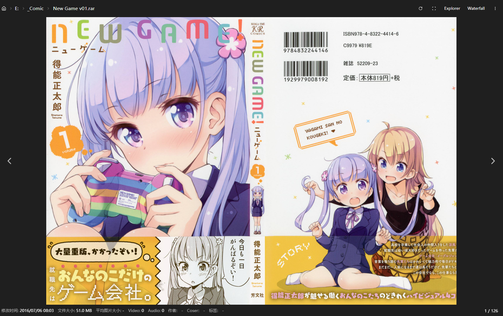

  
  <h1>ShiguReader</h1>
  
A local/LAN-oriented content organization and browsing tool.

  
"Out-of-the-box, simple deployment, perfect for personal collection management."

  

    <a href="README.md">中文</a> | 
    <a href="#ShiguReader">English</a> |
    <a href="README.ja.md">日本語</a>
  

---

## Introduction

ShiguReader is a tool designed for organizing and browsing content over a local network or LAN. It aims to be "ready-to-use, easy to deploy, and ideal for personal collection management."

### Key Features

- **Scan & Organize**: Efficiently indexes local content directories.
- **Unified Browsing**: Provides a consistent web interface for all your collections.
- **Metadata Management**: Tracks basic item info and reading history.
- **Offline First**: Optimized for home networks and small teams without cloud dependency.

### Who It's For

- Individuals looking to consolidate scattered files.
- Users who prefer local/LAN usage over complex cloud deployments.
- Scenarios requiring a portable EXE for direct execution.

### Delivery Options

- **Development**: Run directly from source.
- **Stand-alone**: Build as a single EXE file.
- **Distribution**: Package as a distributable ZIP.

### Documentation

- [Technical Notes (Stack & Implementation)](TECHNICAL.md)
- [EXE Build Guide](build_tools/BUILD.md)

### Screenshots

  
  
<em>Explorer Interface</em>

  
  
<em>Reader Interface</em>

