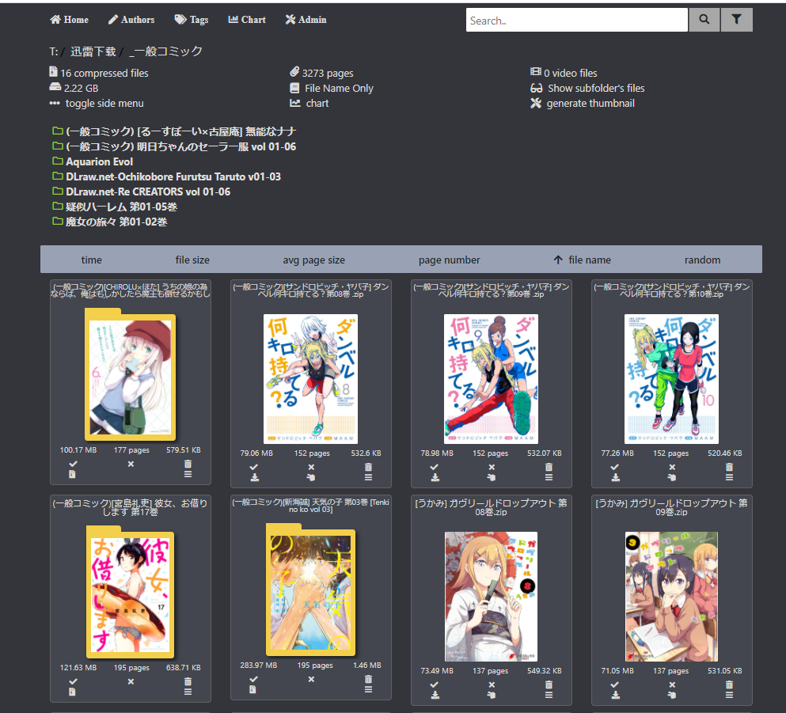
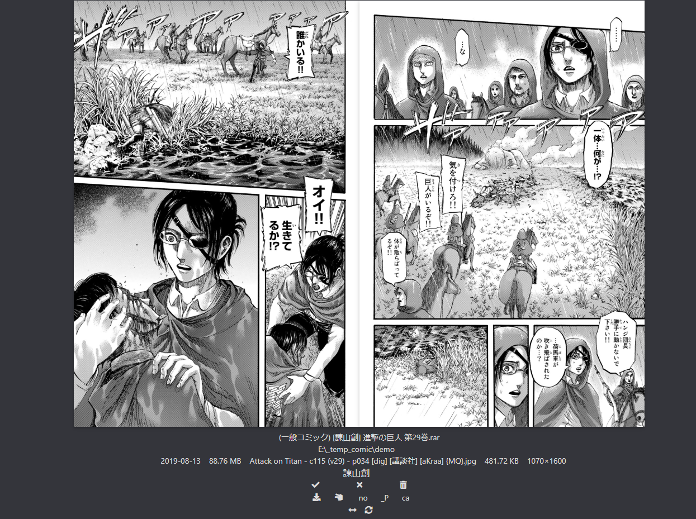
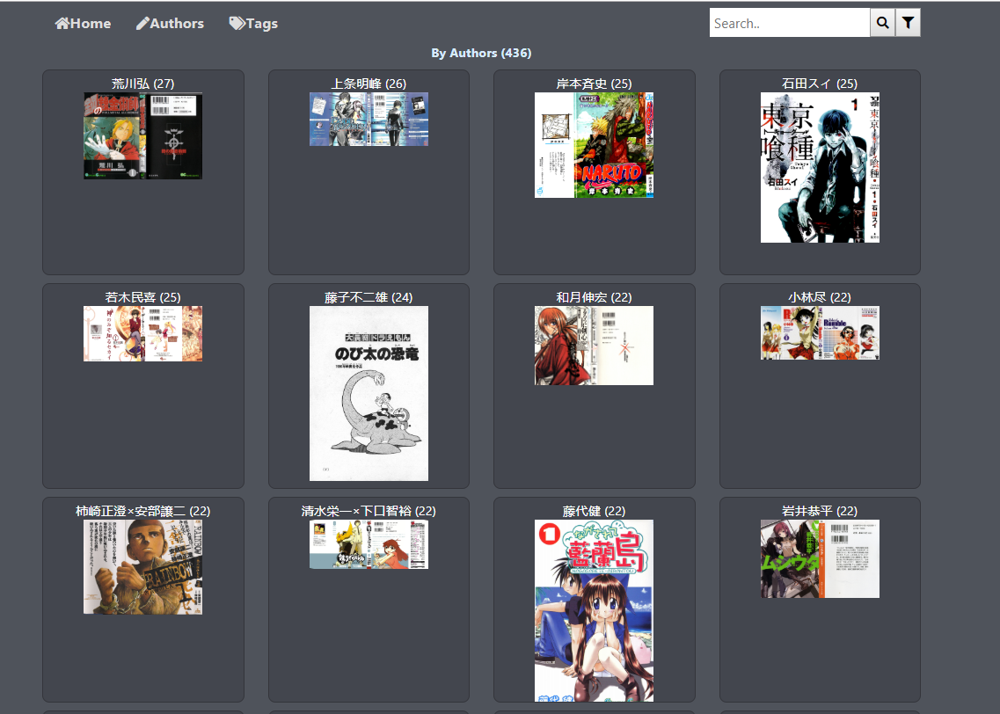
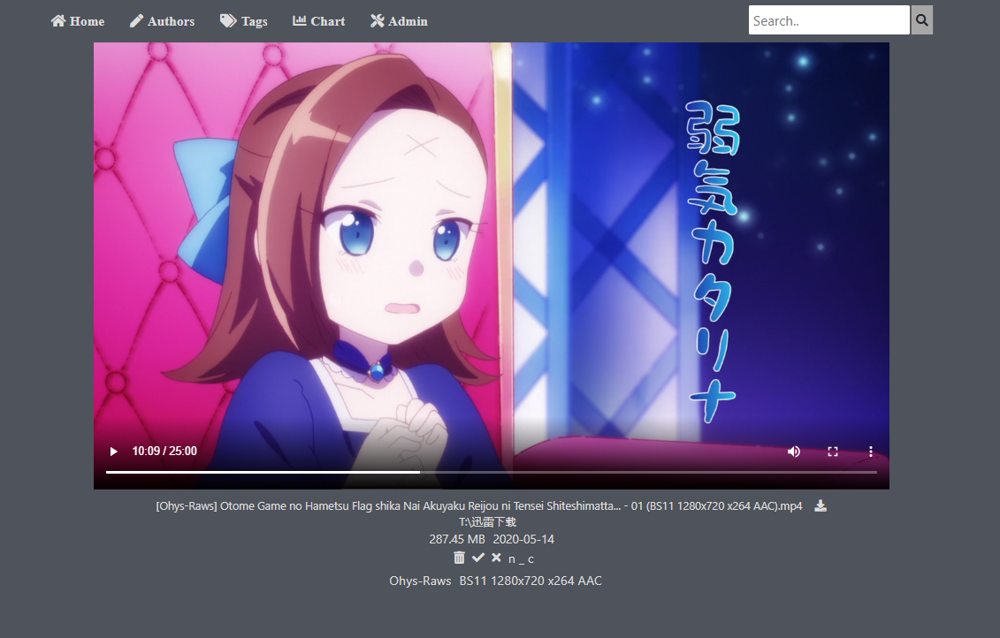
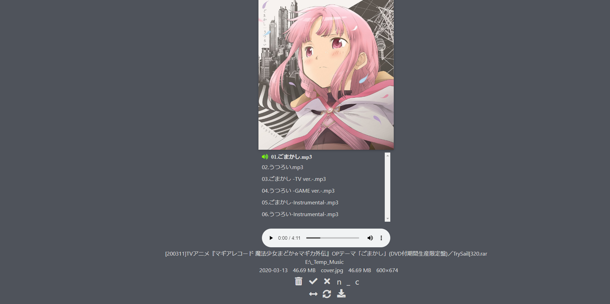
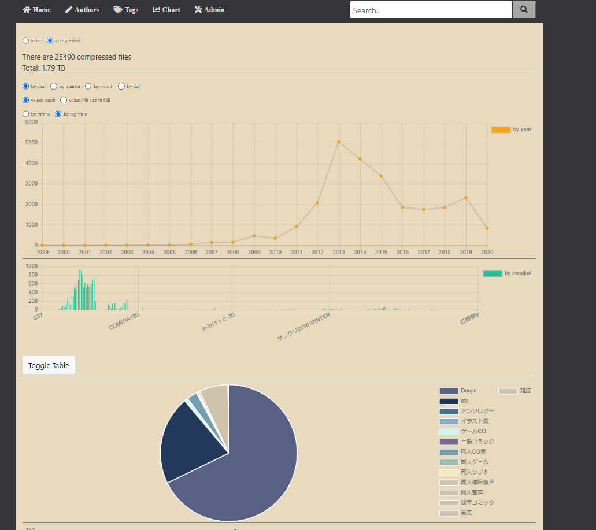
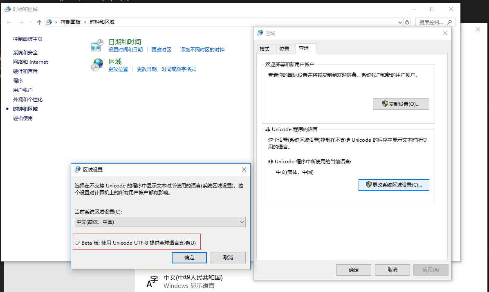

<h1 align="center">ShiguReader</h1>

[](https://github.com/hjyssg/ShiguReader/releases)
[](https://hub.docker.com/r/liwufan/shigureader)
[](https://hub.docker.com/r/liwufan/shigureader)

[English Version](https://github.com/hjyssg/ShiguReader/blob/Dev_Frontend/README_English.md)


ShiguReader是一款可在电脑或iPad上使用的漫画浏览器，它还支持整理资源、播放音乐和观看视频等多种功能。只需前往[Release](https://github.com/hjyssg/ShiguReader/releases)，下载后便可立即开始使用。

##### Screenshots









##### 功能特色

* 可在电脑和iPad上使用。
* 显示每个漫画压缩包的封面，方便浏览。
* 支持播放音乐和视频。
* 提供各种排序和筛选功能。
* 可一键压缩压缩包内的图片，节约硬盘空间。
* 进行特定作者或同人类型的全部文件展示。
* 可移动、删除文件。
* 可制作统计图表，统计文件大小和各时期的文件数量。
* 接近于旧版熊猫网的配色，让你感受亲切熟悉。
* 服务器端同时支持Windows和*nix系统。

##### 支持的文件格式

支持的压缩包格式取决于7Zip。支持常见的zip、rar、7z。图片、音乐和视频的支持格式取决于浏览器。图片格式常见的包括jpg、png和gif，视频格式常见的包括mp4和avi，音乐格式支持mp3和wav等多种格式。

##### 演示视频

ShiguReader的演示视频有些过时了，不过我们会尽快更新新版本的演示视频。你可以通过以下链接找到过去的演示视频  
[iPad使用](https://www.bilibili.com/video/BV1Mt4y1m7qU)  
[PC使用](https://www.bilibili.com/video/BV1t64y1u729/)   
[iPhone使用](https://www.bilibili.com/video/BV1xt4y1U73L/)    

##### 快捷键

漫画页面  
enter: 全屏  
A、D、左右方向键: 翻页  
+和-: 缩放图片 


##### 第三方依赖

虽然ShiguReader可不安装依赖也能使用，但强烈建议安装[image magick](https://imagemagick.org)。这样可以使用它来压缩图片，提高软件的性能。

##### 注意事项

部分文件名带汉字或日语假名的图片无法正常加载，你可能需要进行以下语言设置。请注意，这可能会导致其他非Unicode软件出现乱码问题。

Windows 语言设置如下所示：:  


##### 压缩包内图片压缩功能

[介绍视频](https://www.bilibili.com/video/BV1pi4y147Gu?from=search&seid=13429520178852889848/)     
一些漫画图片过于庞大，比如下载了一本24页共640MB的漫画，但关键画面与一本仅30MB的漫画并没有太大区别。因此，我们添加了压缩包内图片压缩功能。首先，你需要确认是否可以通过cmd运行magick命令。然后就可以通过网页以启动压缩程序，压缩后的文件默认保存在workspace\minified_zip_cache目录里。

##### 配合TamperMonkey使用

    把EhentaiHighighliger.js添加到TamperMonkey。
    在你上绅士网的时候，该脚本会与后端服务器通信。显示文件下载过与否。

##### FAQ

    问： 点击exe后软件无法启动，怎么办？
    答:  默认的3000端口可能已被占用，请尝试更改端口号。
    
    问：某些视频无法播放，怎么办？
    答：视频只是附件功能，支持的格式有限
  
    问：电脑可以正常使用，但是扫描二维码后无法在手机上打开，请问如何解决？
    答：请首先确认电脑和手机是否在同一局域网Wifi下。如果仍然无法打开，请检查电脑防火墙设置。

    问： ShiguReader是啥意思？
    答： Shigure(しぐれ) + Reader。当年的舰C的同人可真好看。

##### 捐赠

如果你喜欢我们的软件，想请我们喝奶茶，可以通过微信扫描以下二维码进行捐赠：  


##### 开发环境设置

开发人员请阅读[Readme_Env_Setup](https://github.com/hjyssg/ShiguReader/blob/Dev_Frontend/Readme_Env_Setup.md)

##### 反馈与建议

如果你仍有疑问或者需要帮助，请在Github上反馈issue。同时，我们也欢迎任何关于改善ShiguReader的建议。


##### DOCKER 使用方法（过时）

```
docker pull liwufan/shigureader
docker run -d -p hostport:3000 -v comicpath:/data liwufan/shigureader

# hostport 是主机要开放的端口
# comicpath 是要扫描的文件目录
```
有问题阅读 [docker配置说明](https://github.com/hjyssg/ShiguReader/blob/dev/dockerguide.md)


##### NAS 使用方法（过时）

[热心人总结的](https://github.com/hjyssg/ShiguReader/issues/90)
