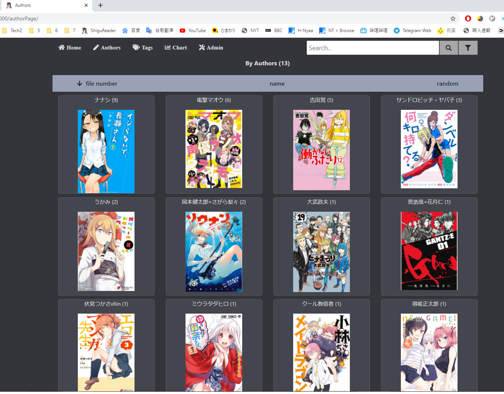

<h1 align="center">ShiguReader</h1>

[](https://github.com/hjyssg/ShiguReader/releases)
[](https://hub.docker.com/r/liwufan/shigureader)
[](https://hub.docker.com/r/liwufan/shigureader)

[English](https://github.com/hjyssg/ShiguReader/blob/dev/README_English.md)


使用电脑或iPad轻松浏览漫画、整理资源、播放音乐、观看视频。  
直接到[Release](https://github.com/hjyssg/ShiguReader/releasesx)下载就能使用。

##### Screenshots





##### Features

* 在电脑和ipad都可以使用。
* 显示每个漫画zip包的封面，便阅览。
* 播放音乐。
* 播放视频。
* 提供各种排序和筛选。
* 一键压缩压缩包内的图片，节约硬盘空间
* 展示特定作者或者同人类型的全部文件。
* 移动删除文件。
* 统计图表。统计文件大小，各时期的文件数量。
* 配色和旧版熊猫网的一模一样，亲切熟悉。
* 服务器端支持windows和*nix。


##### 支持的文件格式

支持的压缩包取决于[7Zip](https://www.7-zip.org/)。常见的zip、rar、7zi都支持。  
图片、音乐和视频的支持格式取决于浏览器。图片常见的jpg、png、png，视频常见的mp4、avi都是支持的。音乐支持mp3、wav。  


##### Demo Video

有点过时了，回头整新的。  
[iPad使用](https://www.bilibili.com/video/BV1Mt4y1m7qU)  
[PC使用](https://www.bilibili.com/video/BV1t64y1u729/)   
[iPhone使用](https://www.bilibili.com/video/BV1xt4y1U73L/)    

##### Dev SetUP

开发人员请阅读[Readme_Env_Setup](https://github.com/hjyssg/ShiguReader/blob/dev/Readme_Env_Setup.md)

##### 第三方依赖

不安装也能用。但强烈建议安装[image magick](https://imagemagick.org)。本软件用它来压缩图片。


##### 注意事项

如果部分文件名带汉字日语假名的图片加载不出来，你可能需要如下语言设置。
但可能导致其他非unicode软件乱码。

windows语言设置:  


##### 压缩包内图片压缩功能

[介绍视频](https://www.bilibili.com/video/BV1pi4y147Gu?from=search&seid=13429520178852889848/)     
现在有的漫画图片明显太大。比如上次下了一本24页640MB，关键画质并没有比1本30MB高出多少。为此添加了压缩包内图片压缩功能。
安装后，自行确认可否在cmd使用magick命令。然后就可以通过网页来启动压缩程序了。
压缩完的文件默认在workspace\minified_zip_cache。

##### DOCKER 使用方法

```
docker pull liwufan/shigureader
docker run -d -p hostport:3000 -v comicpath:/data liwufan/shigureader

# hostport 是主机要开放的端口
# comicpath 是要扫描的文件目录
```
有问题阅读 [docker配置说明](https://github.com/hjyssg/ShiguReader/blob/dev/dockerguide.md)


##### NAS 使用方法

[热心人总结的](https://github.com/hjyssg/ShiguReader/issues/90)


##### 配合TamperMonkey使用

    把EhentaiHighighliger.js添加到TamperMonkey。
    在你上绅士网的时候，该脚本会与后端服务器通信。显示文件下载过与否。

##### FAQ

    问： 点exe闪退。怎么办？
    答:  默认的3000端口被占用了。
    
    问：有的视频播放不了。
    答：视频只是附件功能，有限支持。
  
    问：电脑可以打开使用，可是手机扫了二维码打不开。怎么办
    答：先确认手机是不是和电脑在同一个局域网下。如果是，还打不开。那可能是电脑防火墙设置问题，自行网上搜索。

    问： ShiguReader是啥意思？
    答： Shigure(しぐれ) + Reader。当年的舰C的同人真好看。


##### Donation

想喝奶茶  
微信  


##### 热键

漫画页面  
enter: 全屏  
AD和左右方向键: 翻页  
+-: 缩放图片 

##### 认真看这个readme 还是有问题的话

直接在github issue问

