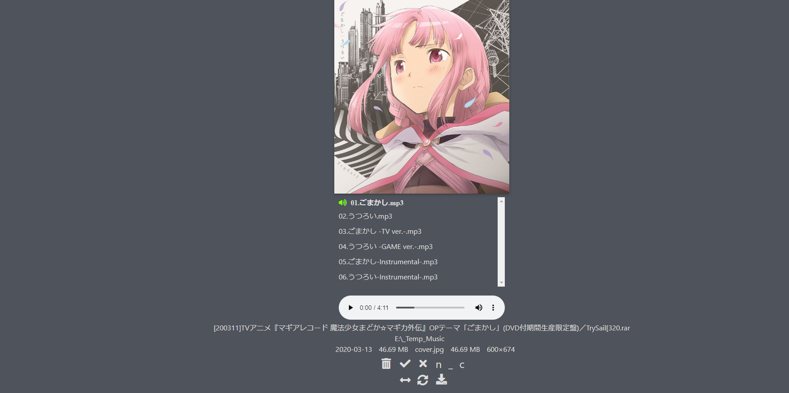
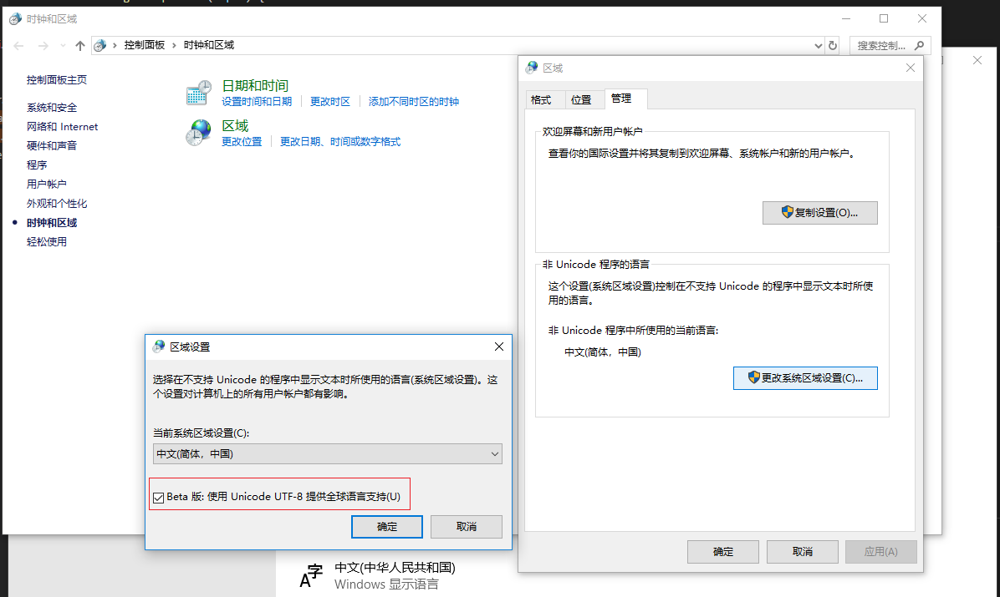

<h1 align="center">ShiguReader</h1>

[](https://github.com/hjyssg/ShiguReader/releases)

ShiguReader is a manga browser that can be used on computers or iPads. It also supports organizing resources, playing music, and watching videos. Simply go to [Release](https://github.com/hjyssg/ShiguReader/releases) and download it to start using immediately.

[中文文档](https://github.com/hjyssg/ShiguReader/blob/Dev_Frontend/README.md)

##### Screenshots





##### Key Features

* Can be used on computers and iPads.
* Displays cover images of each manga archive for easy browsing.
* Supports playing music and videos.
* Provides various sorting and filtering functions, including sorting by favorites.
* Can compress images in a comic archive with a single click, saving disk space.
* Displays all files by specific authors or doujin types.
* Allows moving and deleting files.
* Generates statistical charts to show file sizes and file counts in different periods.
* Adopts a color scheme similar to the old version of Panda website, giving you a sense of familiarity.
* The server-side supports both Windows and Linux systems.


##### Supported File Formats

The supported archive formats depend on 7Zip. Common formats such as zip, rar, and 7z are supported. The supported formats for images, music, and videos depend on the browser. Common image formats include jpg, png, and gif, while common video formats include mp4 and avi. The supported music formats include mp3 and wav, among others.

##### Demo Videos

The demo videos for ShiguReader are somewhat outdated, but we will update them soon. You can find the previous demo videos through the following links:
[iPad](https://www.bilibili.com/video/BV1Mt4y1m7qU)
[PC](https://www.bilibili.com/video/BV1t64y1u729/)
[iPhone](https://www.bilibili.com/video/BV1xt4y1U73L/)

##### Keyboard Shortcuts

**Manga Page**

enter: Fullscreen
A/D and left/right arrow keys: Page navigation
W/S and up/down arrow keys: Scroll vertically
Plus and minus: Image zoom
x: Move to the "no good" folder
v: Move to the "good" folder
g: Quick jump to a page

##### Third-Party Dependencies

While ShiguReader can be used without installing dependencies, it is highly recommended to install [ImageMagick](https://imagemagick.org). This allows you to use it to compress images and improve the software's performance.

##### Notes

Some images with Chinese or Japanese characters in their file names may fail to load properly. You might need to adjust your system's language settings. Be aware that this could cause garbled text in other non-Unicode software.

Windows language settings example:


##### Image Compression Inside Archives

[Introduction Video](https://www.bilibili.com/video/BV1pi4y147Gu?from=search&seid=13429520178852889848/)
Some manga images are too large—for example, a 24-page comic taking 640MB while key frames look similar to a 30MB comic. This feature allows compressing images inside archives. First, ensure you can run the `magick` command from the command line. Then you can launch the compression program from the web page. Compressed files are saved by default in the `workspace\\minified_zip_cache` directory.

##### Usage with TamperMonkey

Add `EhentaiHighighliger.js` to TamperMonkey. When you visit the E-Hentai website, this script will communicate with the backend server to show whether files have been downloaded or not.

##### FAQ

Q: The software doesn't start after clicking the .exe file. What should I do?  
A: The default port 3000 may already be in use. Try changing the port number.   
   ShiguReader_Backend.exe --port 5000  

Q: Some videos cannot be played. What should I do?  
A: Videos are only a supplementary feature, and their supported formats are limited.

Q: The software works fine on my computer, but after scanning the QR code, it doesn't open on my phone. How can I resolve this?  
A: Please make sure that your computer and phone are connected to the same local Wi-Fi network. If it still doesn't open, check your computer's firewall settings.

Q: What does "ShiguReader" mean?
A: ShiguReader is a combination of "Shigure" (しぐれ) and "Reader." The doujinshi of that era's Kantai Collection were really good.

##### Development Environment Setup

please refer to [Readme_Env_Setup](https://github.com/hjyssg/ShiguReader/blob/Dev_Frontend/Readme_Env_Setup.md).

##### Feedback and Suggestions

If you have any questions or need assistance, please provide feedback through issues on GitHub. We also welcome any suggestions for improving ShiguReader.

##### Docker Usage (Outdated)

```
docker pull liwufan/shigureader
docker run -d -p hostport:3000 -v comicpath:/data liwufan/shigureader

# hostport is the port to expose on the host
# comicpath is the directory to scan
```
See the [docker configuration guide](https://github.com/hjyssg/ShiguReader/blob/dev/dockerguide.md) for more information.

##### NAS Usage (Outdated)

[Summary by a helpful user](https://github.com/hjyssg/ShiguReader/issues/90)


